```python
import pandas as pd

# Try different encodings such as 'utf-8', 'latin1', 'ISO-8859-1', 'cp1252'
encodings = ['utf-8', 'latin1', 'ISO-8859-1', 'cp1252']

for encoding in encodings:
    try:
        # Load the CSV file into a DataFrame with the specified encoding
        df = pd.read_csv('Reviews.csv', encoding=encoding)

        # Display the DataFrame
        print(df.head())
        break  # Break the loop if successful
    except UnicodeDecodeError:
        print(f"Failed with encoding {encoding}. Trying the next one.")

```

    Failed with encoding utf-8. Trying the next one.
      Location_Name Located_City                      Location Location_Type  \
    0    Arugam Bay   Arugam Bay  Arugam Bay, Eastern Province       Beaches   
    1    Arugam Bay   Arugam Bay  Arugam Bay, Eastern Province       Beaches   
    2    Arugam Bay   Arugam Bay  Arugam Bay, Eastern Province       Beaches   
    3    Arugam Bay   Arugam Bay  Arugam Bay, Eastern Province       Beaches   
    4    Arugam Bay   Arugam Bay  Arugam Bay, Eastern Province       Beaches   
    
      User_ID           User_Location User_Locale  User_Contributions Travel_Date  \
    0  User 1  Dunsborough, Australia       en_US                   8     2019-07   
    1  User 2      Bendigo, Australia       en_US                   4     2019-06   
    2  User 3    Melbourne, Australia       en_US                  13     2019-07   
    3  User 4      Ericeira, Portugal       en_US                   4     2019-06   
    4  User 5          Pistoia, Italy       en_US                  14     2019-07   
    
                  Published_Date  Rating  Helpful_Votes  \
    0  2019-07-31T07:53:21-04:00       5              1   
    1  2019-07-21T21:50:11-04:00       4              0   
    2  2019-07-15T18:52:55-04:00       5              0   
    3  2019-07-03T10:32:41-04:00       5              0   
    4  2019-07-02T17:07:02-04:00       5              0   
    
                                                   Title  \
    0         Best nail spa in Arugam bay on the water!    
    1                                   Best for surfing   
    2                                 We Love Arugam Bay   
    3                                     Sun and waves.   
    4  Great swimming, surfing, great fish aznd frien...   
    
                                                    Text  
    0  I had a manicure here and it really was profes...  
    1  Overall, it is a wonderful experience. We visi...  
    2  Great place to chill, swim, surf, eat, shop, h...  
    3  Good place for surf and a few stores to going ...  
    4  This place is great for surfing but even if yo...  
    


```python
missing_values = df.isnull().sum()
print("Missing Values:")
print(missing_values)

```

    Missing Values:
    Location_Name         0
    Located_City          0
    Location              0
    Location_Type         0
    User_ID               0
    User_Location         0
    User_Locale           0
    User_Contributions    0
    Travel_Date           0
    Published_Date        0
    Rating                0
    Helpful_Votes         0
    Title                 0
    Text                  0
    dtype: int64
    


```python
# Drop duplicate rows
df.drop_duplicates(inplace=True)


```


```python
# Convert date columns to datetime format with utc=True
df['Travel_Date'] = pd.to_datetime(df['Travel_Date'], errors='coerce', utc=True)
df['Published_Date'] = pd.to_datetime(df['Published_Date'], errors='coerce', utc=True)

```


```python
# Fill missing values in 'Rating' with the mean
df['Rating'] = df['Rating'].fillna(df['Rating'].mean())

# Fill missing values in 'Helpful_Votes' with 0
df['Helpful_Votes'] = df['Helpful_Votes'].fillna(0)


```


```python
# Display the cleaned DataFrame
df.head()

```


<div>
<style scoped>
    .dataframe tbody tr th:only-of-type {
        vertical-align: middle;
    }

    .dataframe tbody tr th {
        vertical-align: top;
    }

    .dataframe thead th {
        text-align: right;
    }
</style>
<table border="1" class="dataframe">
  <thead>
    <tr style="text-align: right;">
      <th></th>
      <th>Location_Name</th>
      <th>Located_City</th>
      <th>Location</th>
      <th>Location_Type</th>
      <th>User_ID</th>
      <th>User_Location</th>
      <th>User_Locale</th>
      <th>User_Contributions</th>
      <th>Travel_Date</th>
      <th>Published_Date</th>
      <th>Rating</th>
      <th>Helpful_Votes</th>
      <th>Title</th>
      <th>Text</th>
    </tr>
  </thead>
  <tbody>
    <tr>
      <th>0</th>
      <td>Arugam Bay</td>
      <td>Arugam Bay</td>
      <td>Arugam Bay, Eastern Province</td>
      <td>Beaches</td>
      <td>User 1</td>
      <td>Dunsborough, Australia</td>
      <td>en_US</td>
      <td>8</td>
      <td>2019-07-01 00:00:00+00:00</td>
      <td>2019-07-31 11:53:21+00:00</td>
      <td>5</td>
      <td>1</td>
      <td>Best nail spa in Arugam bay on the water!</td>
      <td>I had a manicure here and it really was profes...</td>
    </tr>
    <tr>
      <th>1</th>
      <td>Arugam Bay</td>
      <td>Arugam Bay</td>
      <td>Arugam Bay, Eastern Province</td>
      <td>Beaches</td>
      <td>User 2</td>
      <td>Bendigo, Australia</td>
      <td>en_US</td>
      <td>4</td>
      <td>2019-06-01 00:00:00+00:00</td>
      <td>2019-07-22 01:50:11+00:00</td>
      <td>4</td>
      <td>0</td>
      <td>Best for surfing</td>
      <td>Overall, it is a wonderful experience. We visi...</td>
    </tr>
    <tr>
      <th>2</th>
      <td>Arugam Bay</td>
      <td>Arugam Bay</td>
      <td>Arugam Bay, Eastern Province</td>
      <td>Beaches</td>
      <td>User 3</td>
      <td>Melbourne, Australia</td>
      <td>en_US</td>
      <td>13</td>
      <td>2019-07-01 00:00:00+00:00</td>
      <td>2019-07-15 22:52:55+00:00</td>
      <td>5</td>
      <td>0</td>
      <td>We Love Arugam Bay</td>
      <td>Great place to chill, swim, surf, eat, shop, h...</td>
    </tr>
    <tr>
      <th>3</th>
      <td>Arugam Bay</td>
      <td>Arugam Bay</td>
      <td>Arugam Bay, Eastern Province</td>
      <td>Beaches</td>
      <td>User 4</td>
      <td>Ericeira, Portugal</td>
      <td>en_US</td>
      <td>4</td>
      <td>2019-06-01 00:00:00+00:00</td>
      <td>2019-07-03 14:32:41+00:00</td>
      <td>5</td>
      <td>0</td>
      <td>Sun and waves.</td>
      <td>Good place for surf and a few stores to going ...</td>
    </tr>
    <tr>
      <th>4</th>
      <td>Arugam Bay</td>
      <td>Arugam Bay</td>
      <td>Arugam Bay, Eastern Province</td>
      <td>Beaches</td>
      <td>User 5</td>
      <td>Pistoia, Italy</td>
      <td>en_US</td>
      <td>14</td>
      <td>2019-07-01 00:00:00+00:00</td>
      <td>2019-07-02 21:07:02+00:00</td>
      <td>5</td>
      <td>0</td>
      <td>Great swimming, surfing, great fish aznd frien...</td>
      <td>This place is great for surfing but even if yo...</td>
    </tr>
  </tbody>
</table>
</div>


```python
import matplotlib.pyplot as plt
import seaborn as sns
```


```python
# Plot the distribution of ratings
plt.figure(figsize=(8, 6))
sns.histplot(df['Rating'], bins=5, kde=True)  # Using Seaborn for a more informative plot
plt.title('Distribution of Ratings')
plt.xlabel('Rating')
plt.ylabel('Frequency')
plt.show()
```


    
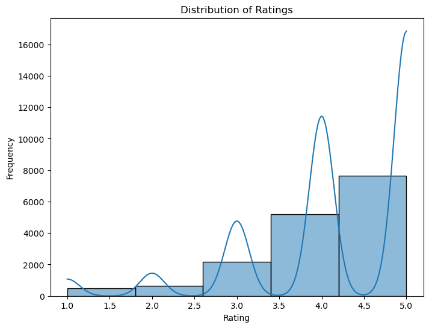
    


```python
# Box plot of ratings
plt.figure(figsize=(8, 6))
sns.boxplot(x=df['Rating'])
plt.title('Box Plot of Ratings')
plt.xlabel('Rating')
plt.show()

```


    
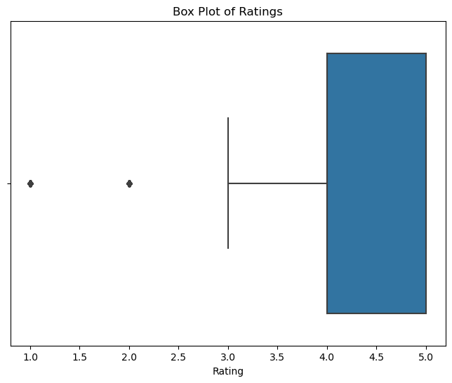
    


```python
# Exclude non-numeric columns from the correlation matrix calculation
numeric_columns = df.select_dtypes(include=['float64', 'int64']).columns
correlation_matrix = df[numeric_columns].corr()

# Plot the correlation matrix
plt.figure(figsize=(10, 8))
sns.heatmap(correlation_matrix, annot=True, cmap='coolwarm', fmt=".2f")
plt.title('Correlation Matrix')
plt.show()

```


    
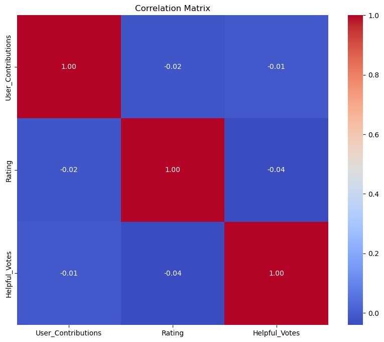
    


```python
# Pair plot
sns.pairplot(df[['Rating', 'Helpful_Votes', 'User_Contributions']])
plt.suptitle('Pair Plot of Ratings, Helpful Votes, and User Contributions')
plt.show()

```


    
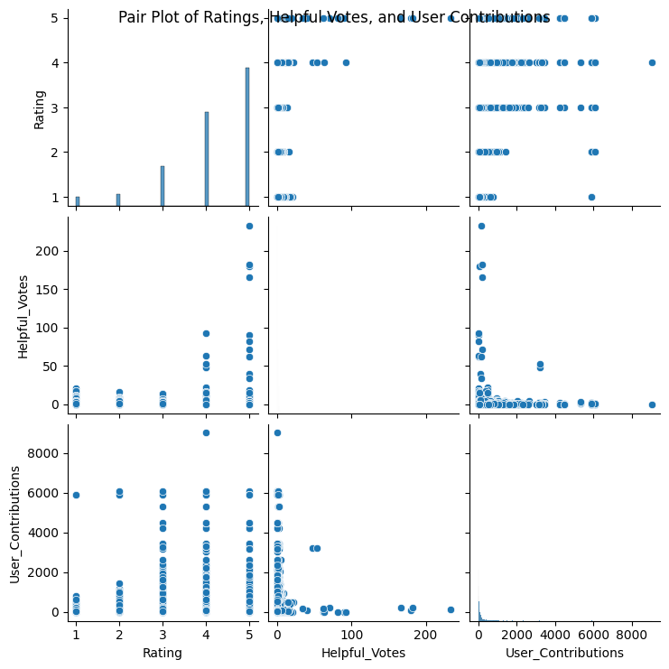
    


```python
location_counts = df['Location_Name'].value_counts()

# Plot the most frequent tourist-received places
plt.figure(figsize=(12, 8))
sns.barplot(x=location_counts.index, y=location_counts.values, palette='viridis')
plt.title('Most Frequent Tourist-Received Places')
plt.xlabel('Location Name')
plt.ylabel('Number of Reviews')
plt.xticks(rotation=90)
plt.show()

```

    C:\ProgramData\anaconda3\Lib\site-packages\IPython\core\pylabtools.py:152: UserWarning: Glyph 146 (\x92) missing from current font.
      fig.canvas.print_figure(bytes_io, **kw)
    


    
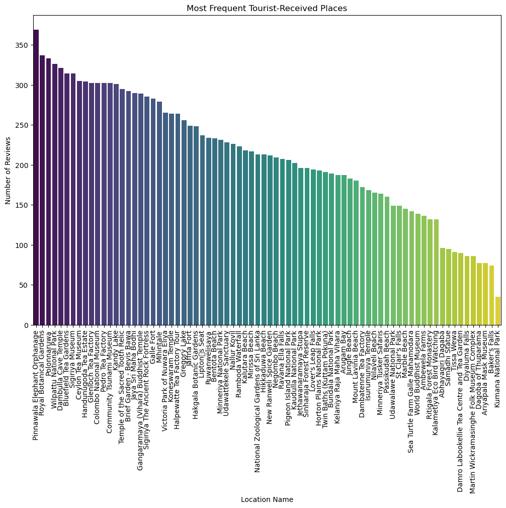
    


```python
df['Travel_Date'] = pd.to_datetime(df['Travel_Date'], errors='coerce')

# Extract the year from 'Travel_Date'
df['Year'] = df['Travel_Date'].dt.year

# Filter the DataFrame for the years 2014 to 2022
years = range(2014, 2023)
for year in years:
    df_year = df[df['Year'] == year]
    
    # Group by 'Location' and sum the number of tourists for each location
    tourist_count_by_location = df_year.groupby('Location')['User_Contributions'].sum().reset_index()
    
    # Sort locations based on the total number of tourists in descending order
    tourist_count_by_location = tourist_count_by_location.sort_values(by='User_Contributions', ascending=False)

# Print the result for the current year
    print(f"\nYear {year} - Locations with most tourists:")
    print(tourist_count_by_location)
```

    
    Year 2014 - Locations with most tourists:
                                                Location  User_Contributions
    2               Anuradhapura, North Central Province               28317
    10           Kandy, Kandy District, Central Province               15452
    16                        Sigiriya, Central Province                5789
    9                          Jaffna, Northern Province                5071
    1     Ambalangoda, Galle District, Southern Province                4399
    5                          Colombo, Western Province                3502
    14                    Nuwara Eliya, Central Province                2839
    15  Saliyapura, Anuradhapura, North Central Province                2815
    11      Katukitula, Kandy District, Central Province                2184
    0        Ahangama, Galle District, Southern Province                1890
    4                         Beruwala, Western Province                1697
    19                                      Uva Province                1408
    8                             Haputale, Uva Province                1108
    18                     Trincomalee, Eastern Province                 698
    7           Galle, Galle District, Southern Province                 518
    6                        Deniyaya, Southern Province                 460
    3                       Arugam Bay, Eastern Province                 278
    12                            Koslanda, Uva Province                 256
    17                  Tissamaharama, Southern Province                 122
    13                        Nilaveli, Eastern Province                  23
    
    Year 2015 - Locations with most tourists:
                                                Location  User_Contributions
    3               Anuradhapura, North Central Province              131891
    13           Kandy, Kandy District, Central Province               31626
    6                          Colombo, Western Province               25002
    11                         Jaffna, Northern Province               23867
    17                    Nuwara Eliya, Central Province               17736
    20                        Sigiriya, Central Province               16314
    14      Katukitula, Kandy District, Central Province               13057
    0        Ahangama, Galle District, Southern Province                5975
    8           Galle, Galle District, Southern Province                5512
    7                        Deniyaya, Southern Province                4953
    15                            Koslanda, Uva Province                4875
    19  Saliyapura, Anuradhapura, North Central Province                4627
    21                  Tissamaharama, Southern Province                4487
    22                     Trincomalee, Eastern Province                3811
    5                         Beruwala, Western Province                3640
    18      Pussellawa, Kandy District, Central Province                3343
    23                                      Uva Province                3249
    9                             Haputale, Uva Province                2189
    1     Ambalangoda, Galle District, Southern Province                1785
    16                        Nilaveli, Eastern Province                1414
    2                           Ampara, Eastern Province                1328
    4                       Arugam Bay, Eastern Province                 493
    12                        Kalutara, Western Province                  97
    10      Hikkaduwa, Galle District, Southern Province                  22
    
    Year 2016 - Locations with most tourists:
                                                Location  User_Contributions
    3               Anuradhapura, North Central Province               82678
    20                    Nuwara Eliya, Central Province               33447
    21      Pussellawa, Kandy District, Central Province               21488
    16           Kandy, Kandy District, Central Province               21347
    23                        Sigiriya, Central Province               16064
    17      Katukitula, Kandy District, Central Province               15664
    6                          Colombo, Western Province               13451
    24                  Tissamaharama, Southern Province               13032
    10                            Haputale, Uva Province               11793
    25                     Trincomalee, Eastern Province                8141
    12                         Jaffna, Northern Province                7003
    11      Hikkaduwa, Galle District, Southern Province                6989
    15                        Kalutara, Western Province                6653
    22  Saliyapura, Anuradhapura, North Central Province                6247
    1     Ambalangoda, Galle District, Southern Province                4980
    26                                      Uva Province                4768
    5                         Beruwala, Western Province                4244
    7                        Deniyaya, Southern Province                3464
    0        Ahangama, Galle District, Southern Province                3458
    19                        Nilaveli, Eastern Province                2496
    14                        Kalkudah, Eastern Province                2048
    27                      Weligatta, Southern Province                1436
    9           Galle, Galle District, Southern Province                 928
    4                       Arugam Bay, Eastern Province                 880
    18                            Koslanda, Uva Province                 708
    2                           Ampara, Eastern Province                 255
    13           Kalametiya, Tangalle, Southern Province                 124
    8                                 Ella, Uva Province                  27
    
    Year 2017 - Locations with most tourists:
                                                Location  User_Contributions
    24                    Nuwara Eliya, Central Province               76179
    3               Anuradhapura, North Central Province               56917
    18           Kandy, Kandy District, Central Province               23940
    31                     Trincomalee, Eastern Province               19895
    7                          Colombo, Western Province               19378
    29                        Sigiriya, Central Province               15456
    14                         Jaffna, Northern Province               12483
    27      Pussellawa, Kandy District, Central Province               11142
    12                            Haputale, Uva Province               10931
    22                        Nilaveli, Eastern Province               10804
    28  Saliyapura, Anuradhapura, North Central Province                9743
    30                  Tissamaharama, Southern Province                9498
    16                        Kalkudah, Eastern Province                8597
    19      Katukitula, Kandy District, Central Province                7968
    17                        Kalutara, Western Province                7576
    0        Ahangama, Galle District, Southern Province                6665
    13      Hikkaduwa, Galle District, Southern Province                6320
    33                                      Uva Province                4953
    20                            Koslanda, Uva Province                4120
    9                                 Ella, Uva Province                4084
    34                      Weligatta, Southern Province                3688
    6                         Beruwala, Western Province                3057
    4                       Arugam Bay, Eastern Province                2869
    8                        Deniyaya, Southern Province                2521
    11                  Habarana, North Central Province                1838
    10          Galle, Galle District, Southern Province                1489
    1     Ambalangoda, Galle District, Southern Province                 933
    26               Polonnaruwa, North Central Province                 931
    21                         Negombo, Western Province                 689
    32      Unawatuna, Galle District, Southern Province                 649
    25                  Pinnawala, Sabaragamuwa Province                 576
    5         Bentota, Galle District, Southern Province                 457
    23                            North Central Province                 270
    15           Kalametiya, Tangalle, Southern Province                 249
    2                           Ampara, Eastern Province                 237
    
    Year 2018 - Locations with most tourists:
                                                Location  User_Contributions
    3               Anuradhapura, North Central Province              145567
    25                    Nuwara Eliya, Central Province              122419
    7                          Colombo, Western Province               61486
    18           Kandy, Kandy District, Central Province               53936
    28               Polonnaruwa, North Central Province               42206
    11                  Habarana, North Central Province               34868
    14                         Jaffna, Northern Province               27069
    29      Pussellawa, Kandy District, Central Province               21098
    27                  Pinnawala, Sabaragamuwa Province               20300
    31                        Sigiriya, Central Province               18049
    9                                 Ella, Uva Province               15576
    24                            North Central Province               15284
    13      Hikkaduwa, Galle District, Southern Province               14937
    12                            Haputale, Uva Province               12912
    26      Peradeniya, Kandy District, Central Province               11340
    10          Galle, Galle District, Southern Province                9444
    17                        Kalutara, Western Province                9332
    23                        Nilaveli, Eastern Province                8560
    33                     Trincomalee, Eastern Province                8145
    30  Saliyapura, Anuradhapura, North Central Province                7087
    5         Bentota, Galle District, Southern Province                6949
    22                         Negombo, Western Province                6659
    36                      Weligatta, Southern Province                6191
    19      Katukitula, Kandy District, Central Province                6169
    20                            Koslanda, Uva Province                5648
    0        Ahangama, Galle District, Southern Province                5453
    32                  Tissamaharama, Southern Province                4928
    8                        Deniyaya, Southern Province                4809
    16                        Kalkudah, Eastern Province                3949
    34      Unawatuna, Galle District, Southern Province                3171
    6                         Beruwala, Western Province                2656
    4                       Arugam Bay, Eastern Province                2645
    15           Kalametiya, Tangalle, Southern Province                1969
    1     Ambalangoda, Galle District, Southern Province                1967
    35                                      Uva Province                1617
    21                        Mirissa, Southern Province                 479
    2                           Ampara, Eastern Province                 368
    
    Year 2019 - Locations with most tourists:
                                                Location  User_Contributions
    18           Kandy, Kandy District, Central Province              100172
    3               Anuradhapura, North Central Province               97776
    25                    Nuwara Eliya, Central Province               93705
    10          Galle, Galle District, Southern Province               62918
    7                          Colombo, Western Province               58226
    11                  Habarana, North Central Province               54635
    26      Peradeniya, Kandy District, Central Province               48720
    28               Polonnaruwa, North Central Province               46663
    31                        Sigiriya, Central Province               36073
    9                                 Ella, Uva Province               35552
    14                         Jaffna, Northern Province               26054
    22                         Negombo, Western Province               24826
    13      Hikkaduwa, Galle District, Southern Province               23590
    33                     Trincomalee, Eastern Province               18742
    21                        Mirissa, Southern Province               15405
    24                            North Central Province               15137
    37                      Weligatta, Southern Province               11934
    27                  Pinnawala, Sabaragamuwa Province               11637
    19      Katukitula, Kandy District, Central Province               10267
    5         Bentota, Galle District, Southern Province                9355
    12                            Haputale, Uva Province                8452
    29      Pussellawa, Kandy District, Central Province                8016
    30  Saliyapura, Anuradhapura, North Central Province                6101
    35      Unawatuna, Galle District, Southern Province                5703
    34                           Udawalawe National Park                4488
    0        Ahangama, Galle District, Southern Province                4118
    16                        Kalkudah, Eastern Province                3924
    20                            Koslanda, Uva Province                3718
    6                         Beruwala, Western Province                3469
    36                                      Uva Province                3041
    17                        Kalutara, Western Province                2464
    23                        Nilaveli, Eastern Province                2035
    15           Kalametiya, Tangalle, Southern Province                1959
    8                        Deniyaya, Southern Province                1781
    32                  Tissamaharama, Southern Province                1191
    4                       Arugam Bay, Eastern Province                 561
    2                           Ampara, Eastern Province                 508
    1     Ambalangoda, Galle District, Southern Province                 403
    
    Year 2020 - Locations with most tourists:
                                                Location  User_Contributions
    3               Anuradhapura, North Central Province               49322
    18           Kandy, Kandy District, Central Province               39079
    25                    Nuwara Eliya, Central Province               23326
    31                        Sigiriya, Central Province               22986
    10          Galle, Galle District, Southern Province               20570
    28               Polonnaruwa, North Central Province               14259
    7                          Colombo, Western Province               13889
    26      Peradeniya, Kandy District, Central Province               13173
    34                           Udawalawe National Park                9845
    11                  Habarana, North Central Province                9071
    5         Bentota, Galle District, Southern Province                8169
    9                                 Ella, Uva Province                7793
    17                        Kalutara, Western Province                7745
    21                        Mirissa, Southern Province                5247
    14                         Jaffna, Northern Province                5181
    22                         Negombo, Western Province                3786
    35      Unawatuna, Galle District, Southern Province                3694
    27                  Pinnawala, Sabaragamuwa Province                3550
    19      Katukitula, Kandy District, Central Province                2525
    30  Saliyapura, Anuradhapura, North Central Province                2351
    24                            North Central Province                1932
    33                     Trincomalee, Eastern Province                1931
    12                            Haputale, Uva Province                1449
    15           Kalametiya, Tangalle, Southern Province                1332
    0        Ahangama, Galle District, Southern Province                1272
    13      Hikkaduwa, Galle District, Southern Province                1221
    16                        Kalkudah, Eastern Province                 764
    36                      Weligatta, Southern Province                 749
    6                         Beruwala, Western Province                 517
    8                        Deniyaya, Southern Province                 375
    23                        Nilaveli, Eastern Province                 310
    20                            Koslanda, Uva Province                 142
    1     Ambalangoda, Galle District, Southern Province                 107
    29      Pussellawa, Kandy District, Central Province                  91
    2                           Ampara, Eastern Province                  44
    4                       Arugam Bay, Eastern Province                  30
    32                  Tissamaharama, Southern Province                  20
    
    Year 2021 - Locations with most tourists:
                                              Location  User_Contributions
    2             Anuradhapura, North Central Province                2452
    23                      Sigiriya, Central Province                2236
    14         Kandy, Kandy District, Central Province                1409
    18                  Nuwara Eliya, Central Province                 709
    9                 Habarana, North Central Province                 616
    11    Hikkaduwa, Galle District, Southern Province                 510
    26    Unawatuna, Galle District, Southern Province                 494
    19    Peradeniya, Kandy District, Central Province                 385
    10                          Haputale, Uva Province                 322
    5                        Colombo, Western Province                 315
    6                      Deniyaya, Southern Province                 293
    25                         Udawalawe National Park                 282
    16                      Mirissa, Southern Province                 250
    3       Bentota, Galle District, Southern Province                 238
    8         Galle, Galle District, Southern Province                 204
    4                       Beruwala, Western Province                 195
    22    Pussellawa, Kandy District, Central Province                 126
    20                Pinnawala, Sabaragamuwa Province                 113
    24                   Trincomalee, Eastern Province                  81
    1   Ambalangoda, Galle District, Southern Province                  62
    17                       Negombo, Western Province                  26
    7                               Ella, Uva Province                  24
    15                          Koslanda, Uva Province                  13
    21             Polonnaruwa, North Central Province                  13
    0      Ahangama, Galle District, Southern Province                   9
    27                    Weligatta, Southern Province                   9
    13         Kalametiya, Tangalle, Southern Province                   7
    12                       Jaffna, Northern Province                   5
    
    Year 2022 - Locations with most tourists:
                                                Location  User_Contributions
    15           Kandy, Kandy District, Central Province               13218
    22                    Nuwara Eliya, Central Province               11407
    28                        Sigiriya, Central Province                8508
    7           Galle, Galle District, Southern Province                7745
    23      Peradeniya, Kandy District, Central Province                6563
    8                   Habarana, North Central Province                5234
    25               Polonnaruwa, North Central Province                5192
    1               Anuradhapura, North Central Province                4549
    6                                 Ella, Uva Province                3147
    16      Katukitula, Kandy District, Central Province                2963
    32      Unawatuna, Galle District, Southern Province                2123
    31                           Udawalawe National Park                1801
    21                            North Central Province                1736
    0        Ahangama, Galle District, Southern Province                1655
    26      Pussellawa, Kandy District, Central Province                1653
    24                  Pinnawala, Sabaragamuwa Province                1360
    29                  Tissamaharama, Southern Province                1257
    18                        Mirissa, Southern Province                1043
    4                          Colombo, Western Province                 783
    10      Hikkaduwa, Galle District, Southern Province                 671
    12           Kalametiya, Tangalle, Southern Province                 619
    11                         Jaffna, Northern Province                 590
    19                         Negombo, Western Province                 590
    13                        Kalkudah, Eastern Province                 341
    9                             Haputale, Uva Province                 179
    17                            Koslanda, Uva Province                 168
    14                        Kalutara, Western Province                 145
    3         Bentota, Galle District, Southern Province                 142
    30                     Trincomalee, Eastern Province                 125
    33                      Weligatta, Southern Province                 122
    2                       Arugam Bay, Eastern Province                  92
    5                        Deniyaya, Southern Province                  71
    27  Saliyapura, Anuradhapura, North Central Province                  45
    20                        Nilaveli, Eastern Province                  19
    


```python
df['Travel_Date'] = pd.to_datetime(df['Travel_Date'], errors='coerce')

# Extract the year from 'Travel_Date'
df['Year'] = df['Travel_Date'].dt.year

# Group by year and sum the number of tourists for each year
tourist_count_by_year = df.groupby('Year')['User_Contributions'].sum().reset_index()

# Find the year with the maximum total number of tourists
max_tourists_year = tourist_count_by_year.loc[tourist_count_by_year['User_Contributions'].idxmax()]

# Display the result
print(f"The year with the most tourists is {int(max_tourists_year['Year'])} with a total of {int(max_tourists_year['User_Contributions'])} tourists.")
```

    The year with the most tourists is 2019 with a total of 863319 tourists.
    


```python
df['Travel_Date'] = pd.to_datetime(df['Travel_Date'], errors='coerce')

# Extract the year from 'Travel_Date'
df['Year'] = df['Travel_Date'].dt.year

# Group by year and sum the number of tourists for each year
tourist_count_by_year = df.groupby('Year')['User_Contributions'].sum().reset_index()

# Plot the total number of tourists for each year
plt.figure(figsize=(10, 6))
sns.barplot(x='Year', y='User_Contributions', data=tourist_count_by_year, palette='viridis', dodge=False)
plt.title('Total Number of Tourists Each Year')
plt.xlabel('Year')
plt.ylabel('Total Tourists')
plt.show()
```


    
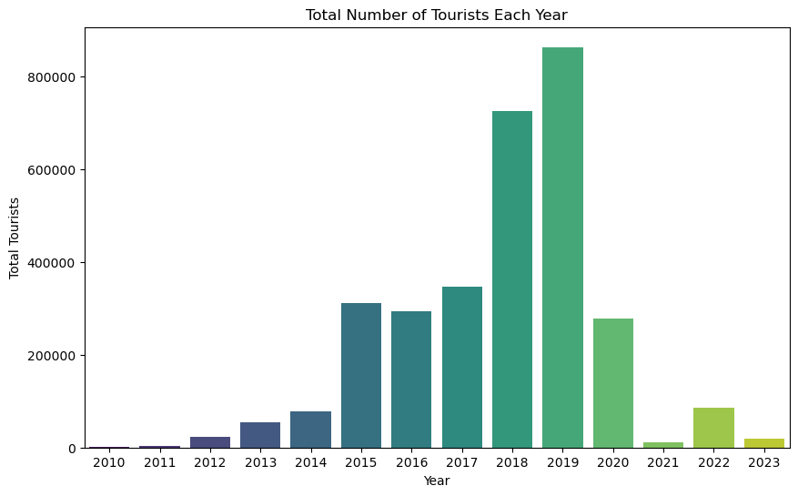
    


```python
# Group by 'User_Location' and sum the number of tourists for each country
tourist_count_by_country = df.groupby('User_Location')['User_Contributions'].sum().reset_index()

# Sort the DataFrame by the total number of tourists in descending order
tourist_count_by_country = tourist_count_by_country.sort_values(by='User_Contributions', ascending=False)

# Display the country with the most tourists
most_tourists_country = tourist_count_by_country.iloc[0]['User_Location']
total_tourists = tourist_count_by_country.iloc[0]['User_Contributions']

print(f"The country with the most tourists is {most_tourists_country} with a total of {total_tourists} tourists.")
```

    The country with the most tourists is London, United Kingdom with a total of 319628 tourists.
    


```python
tourist_count_by_country = df.groupby('User_Location')['User_Contributions'].sum().reset_index()

# Sort the DataFrame by the total number of tourists in descending order
tourist_count_by_country = tourist_count_by_country.sort_values(by='User_Contributions', ascending=False)

# Plot the total number of tourists for each country
plt.figure(figsize=(12, 6))
sns.barplot(x='User_Location', y='User_Contributions', data=tourist_count_by_country.head(10), palette='viridis', dodge=False)
plt.title('Top 10 Countries with the Most Tourists')
plt.xlabel('Country')
plt.ylabel('Total Tourists')
plt.xticks(rotation=45, ha='right')
plt.show()
```


    
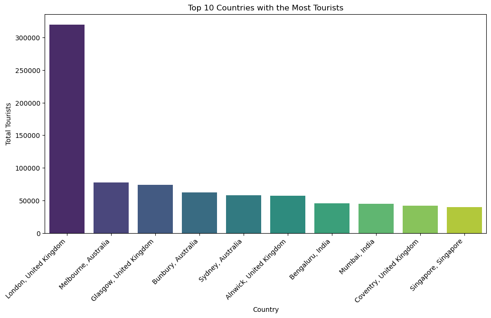
    


```python
df['Year'] = pd.to_datetime(df['Travel_Date'], errors='coerce').dt.year

# Filter the DataFrame for the years 2010 to 2023
years = range(2010, 2024)
df_filtered = df[df['Year'].isin(years)]

# Group by 'Location' and calculate the average rating for each place
average_rating_by_place = df_filtered.groupby('Location')['Rating'].mean().reset_index()

# Plot the average rating for each place
plt.figure(figsize=(12, 6))
sns.barplot(x='Location', y='Rating', hue='Location', data=average_rating_by_place.head(10), palette='viridis', dodge=False, legend=False)
plt.title('Top 10 Places with the Highest Average Ratings (2010-2023)')
plt.xlabel('Place')
plt.ylabel('Average Rating')
plt.xticks(rotation=45, ha='right')
plt.show()
```


    
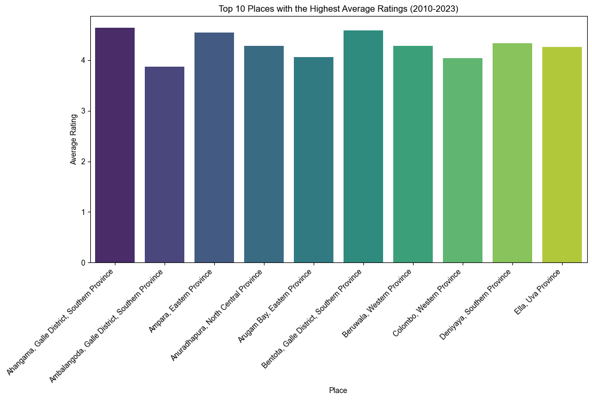
    


```python
df['Year'] = pd.to_datetime(df['Travel_Date'], errors='coerce').dt.year

# Filter data for the years 2010 to 2023
years_of_interest = range(2010, 2024)
df_filtered = df[df['Year'].isin(years_of_interest)]

# Group by 'Location' and calculate the average rating for each place
average_rating_by_place = df_filtered.groupby('Location')['Rating'].mean().reset_index()

# Sort the DataFrame by average rating in descending order
average_rating_by_place = average_rating_by_place.sort_values(by='Rating', ascending=False)

# Display the result
print("Average Rating by Place:")
print(average_rating_by_place)
```

    Average Rating by Place:
                                                Location    Rating
    15           Kalametiya, Tangalle, Southern Province  4.992424
    37                      Weligatta, Southern Province  4.698413
    34                           Udawalawe National Park  4.677852
    0        Ahangama, Galle District, Southern Province  4.638158
    5         Bentota, Galle District, Southern Province  4.587983
    26      Peradeniya, Kandy District, Central Province  4.572700
    16                        Kalkudah, Eastern Province  4.562500
    2                           Ampara, Eastern Province  4.542857
    20                            Koslanda, Uva Province  4.488372
    11                  Habarana, North Central Province  4.449331
    32                  Tissamaharama, Southern Province  4.428571
    28               Polonnaruwa, North Central Province  4.423423
    10          Galle, Galle District, Southern Province  4.422701
    24                            North Central Province  4.411255
    13      Hikkaduwa, Galle District, Southern Province  4.400000
    8                        Deniyaya, Southern Province  4.331633
    29      Pussellawa, Kandy District, Central Province  4.322870
    6                         Beruwala, Western Province  4.284247
    33                     Trincomalee, Eastern Province  4.281174
    3               Anuradhapura, North Central Province  4.278726
    21                        Mirissa, Southern Province  4.267281
    9                                 Ella, Uva Province  4.259023
    31                        Sigiriya, Central Province  4.163827
    14                         Jaffna, Northern Province  4.141053
    30  Saliyapura, Anuradhapura, North Central Province  4.076687
    4                       Arugam Bay, Eastern Province  4.058824
    23                        Nilaveli, Eastern Province  4.040431
    7                          Colombo, Western Province  4.039283
    12                            Haputale, Uva Province  4.039120
    18           Kandy, Kandy District, Central Province  4.033108
    25                    Nuwara Eliya, Central Province  3.999068
    36                                      Uva Province  3.959459
    1     Ambalangoda, Galle District, Southern Province  3.870130
    19      Katukitula, Kandy District, Central Province  3.824503
    17                        Kalutara, Western Province  3.665138
    35      Unawatuna, Galle District, Southern Province  3.535519
    27                  Pinnawala, Sabaragamuwa Province  3.420054
    22                         Negombo, Western Province  3.119617
    


```python
df['Year'] = pd.to_datetime(df['Travel_Date'], errors='coerce').dt.year

# Filter data for the years 2010 to 2023 and for Arugam Bay
years_of_interest = range(2010, 2024)
arugam_bay_data = df[(df['Year'].isin(years_of_interest)) & (df['Location_Name'] == 'Arugam Bay')]

# Calculate the total number of tourists for Arugam Bay for each year
tourist_count_by_year = arugam_bay_data.groupby('Year')['User_Contributions'].sum().reset_index()

# Display the result
print("Total Tourists in Arugam Bay by Year:")
print(tourist_count_by_year)
```

    Total Tourists in Arugam Bay by Year:
        Year  User_Contributions
    0   2011                 288
    1   2012                 237
    2   2013                 581
    3   2014                 278
    4   2015                 493
    5   2016                 880
    6   2017                2869
    7   2018                2645
    8   2019                 561
    9   2020                  30
    10  2022                  92
    


```python
print("\nSummary Statistics:")
print(df.describe())
```

    
    Summary Statistics:
           User_Contributions        Rating  Helpful_Votes          Year
    count        16156.000000  16156.000000   16156.000000  16156.000000
    mean           191.624845      4.167492       0.709458   2017.598106
    std            500.100421      1.006840       3.672513      1.971124
    min              1.000000      1.000000       0.000000   2010.000000
    25%             18.000000      4.000000       0.000000   2016.000000
    50%             54.000000      4.000000       0.000000   2018.000000
    75%            155.000000      5.000000       1.000000   2019.000000
    max           9010.000000      5.000000     233.000000   2023.000000
    


```python
print("\nMissing Values:")
print(df.isnull().sum())
```

    
    Missing Values:
    Location_Name         0
    Located_City          0
    Location              0
    Location_Type         0
    User_ID               0
    User_Location         0
    User_Locale           0
    User_Contributions    0
    Travel_Date           0
    Published_Date        0
    Rating                0
    Helpful_Votes         0
    Title                 0
    Text                  0
    Year                  0
    dtype: int64
    


```python
print("\nUnique Values:")
print(df['Location_Name'].unique())
print(df['User_Location'].unique())
```

    
    Unique Values:
    ['Arugam Bay' 'Bentota Beach' 'Hikkaduwa Beach' 'Jungle Beach'
     'Kalutara Beach' 'Marble Beach' 'Mirissa Beach' 'Mount Lavinia Beach'
     'Negombo Beach' 'Nilaveli Beach' 'Passikudah Beach' 'Gregory Lake'
     'Kandy Lake' 'Tissa Wewa' 'Twin Baths (Kuttam Pokuna)' 'Ambewela Farms'
     'Bluefield Tea Gardens' 'Dambatenne Tea Factory'
     'Damro Labookellie Tea Centre and Tea Garden' 'Glenloch Tea Factory'
     'Halpewatte Tea Factory Tour' 'Handunugoda Tea Estate'
     'Pedro Tea Factory' 'Brief Garden - Bevis Bawa' 'Hakgala Botanic Gardens'
     'New Ranweli Spice Garden' 'Royal Botanical Gardens'
     'Victoria Park of Nuwara Eliya' 'Galle Fort' 'Jaffna Fort'
     'Lipton\x92s Seat' 'Polonnaruwa' 'Ritigala Forest Monastery'
     'Sigiriya The Ancient Rock Fortress' 'Ariyapala Mask Museum'
     'Ceylon Tea Museum' 'Colombo National Museum' 'Community Tsunami Museum'
     'Martin Wickramasinghe Folk Museum Complex' 'Sigiriya Museum'
     'World Buddhist Museum' 'Bundala National Park'
     'Horton Plains National Park' 'Kaudulla National Park'
     'Kumana National Park' 'Minneriya National Park'
     'Pigeon Island National Park' 'Udawalawe National Park'
     'Kalametiya Eco Bird Watching' 'Minneriya Tusker Safaris'
     'Pinnawala Elephant Orphanage' 'Sea Turtle Farm Galle Mahamodara'
     'Sinharaja Forest Reserve' 'Udawattekele Sanctuary'
     'Wilpattu National Park' "Baker's Falls" 'Diyaluma Falls'
     "Lover's Leap Falls" 'Ramboda Waterfall' 'Ravana Ella Falls'
     "St Clair's Falls" 'National Zoological Gardens of Sri Lanka'
     'Dagoba of Thuparama' 'Isurumuniya Temple' 'Jaya Sri Maha Bodhi'
     'Jethawanaramaya Stupa' 'Mihintale' 'Ruwanwelisaya' 'Abhayagiri Dagaba'
     'Samadhi Statue' 'Kelaniya Raja Maha Vihara'
     'Gangaramaya (Vihara) Buddhist Temple' 'Temple of the Sacred Tooth Relic'
     'Dambulla Cave Temple' 'Koneswaram Temple' 'Nallur Kovil']
    ['Dunsborough, Australia' 'Bendigo, Australia' 'Melbourne, Australia' ...
     'Skaering, Denmark' 'Lanzarote, Spain' 'Framingham, Massachusetts']
    


```python
df['Rating'].hist()
plt.title('Distribution of Ratings')
plt.xlabel('Rating')
plt.ylabel('Frequency')
plt.show()
```


    
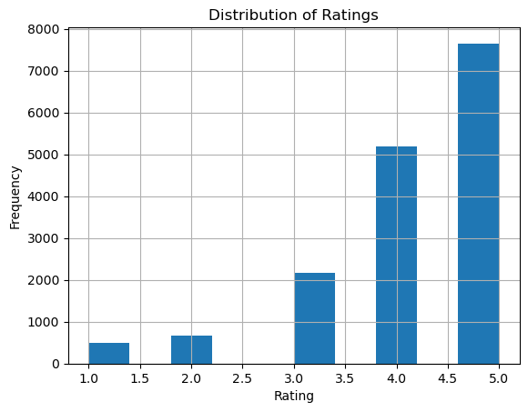
    


```python
#Convert 'Travel_Date' and 'Published_Date' to datetime format
df['Travel_Date'] = pd.to_datetime(df['Travel_Date'], errors='coerce')
df['Published_Date'] = pd.to_datetime(df['Published_Date'], errors='coerce')
```


```python
df_encoded = pd.get_dummies(df, columns=['Location_Name', 'Located_City', 'User_Location', 'User_Locale'])
```


```python
# Display the columns of the encoded DataFrame
print("Encoded DataFrame Columns:")
print(df_encoded.columns)


```

    Encoded DataFrame Columns:
    Index(['Location', 'Location_Type', 'User_ID', 'User_Contributions',
           'Travel_Date', 'Published_Date', 'Rating', 'Helpful_Votes', 'Title',
           'Text',
           ...
           'User_Locale_ru_RU', 'User_Locale_sk', 'User_Locale_sk_SK',
           'User_Locale_sr', 'User_Locale_sv', 'User_Locale_sv_SE',
           'User_Locale_tr', 'User_Locale_tr_TR', 'User_Locale_vi',
           'User_Locale_zh_TW'],
          dtype='object', length=3546)
    


```python
# Display the column names of the DataFrame
print(df.columns)

```

    Index(['Location_Name', 'Located_City', 'Location', 'Location_Type', 'User_ID',
           'User_Location', 'User_Locale', 'User_Contributions', 'Travel_Date',
           'Published_Date', 'Rating', 'Helpful_Votes', 'Title', 'Text', 'Year'],
          dtype='object')
    


```python
# Use the original column names before one-hot encoding
selected_features = ['Location_Name', 'Located_City', 'Rating', 'Helpful_Votes']
df_selected = df[selected_features]

# Explore relationships between features
sns.pairplot(df_selected, hue='Location_Name')
plt.title('Pair Plot of Selected Features')
plt.show()

```

    C:\ProgramData\anaconda3\Lib\site-packages\seaborn\utils.py:80: UserWarning: Glyph 146 (\x92) missing from current font.
      fig.canvas.draw()
    C:\ProgramData\anaconda3\Lib\site-packages\seaborn\axisgrid.py:118: UserWarning: The figure layout has changed to tight
      self._figure.tight_layout(*args, **kwargs)
    C:\ProgramData\anaconda3\Lib\site-packages\IPython\core\pylabtools.py:152: UserWarning: Glyph 146 (\x92) missing from current font.
      fig.canvas.print_figure(bytes_io, **kw)
    


    
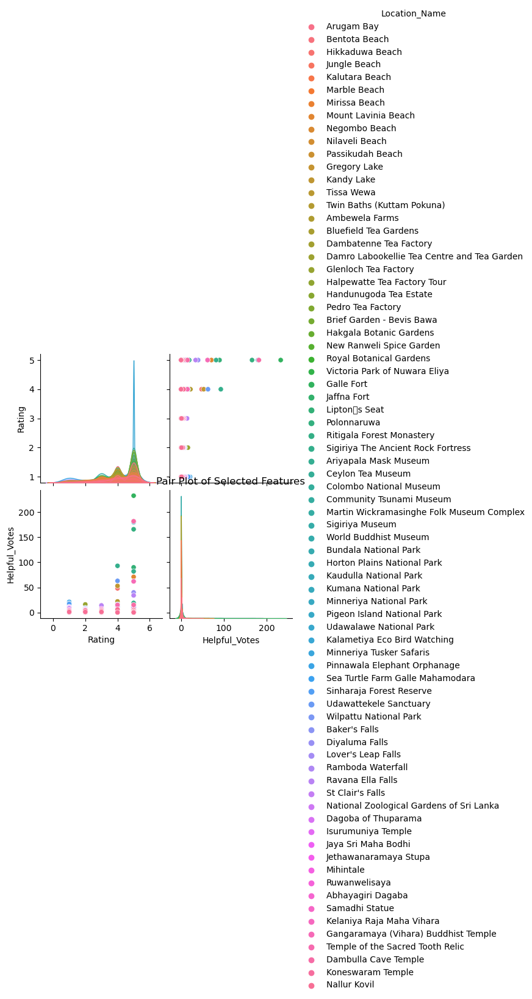
    


```python
# Exclude non-numeric columns from the correlation matrix calculation
numeric_columns = df_selected.select_dtypes(include=['float64', 'int64']).columns
correlation_matrix = df_selected[numeric_columns].corr()

# Plot the correlation matrix
plt.figure(figsize=(10, 8))
sns.heatmap(correlation_matrix, annot=True, cmap='coolwarm', fmt=".2f")
plt.title('Correlation Matrix')
plt.show()

```


    
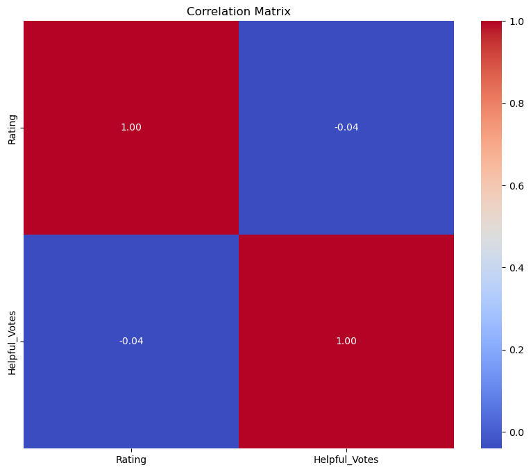
    


```python
# Analyze the average rating for each location
average_rating_by_location = df_selected.groupby('Location_Name')['Rating'].mean().reset_index()
average_rating_by_location = average_rating_by_location.sort_values(by='Rating', ascending=False)
print("Average Rating by Location:")
print(average_rating_by_location)
```

    Average Rating by Location:
                                   Location_Name    Rating
    31              Kalametiya Eco Bird Watching  4.992424
    8                      Bundala National Park  4.698413
    71                   Udawalawe National Park  4.677852
    11                  Community Tsunami Museum  4.665563
    65        Sigiriya The Ancient Rock Fortress  4.645614
    ..                                       ...       ...
    30                              Jungle Beach  3.535519
    55              Pinnawala Elephant Orphanage  3.420054
    13                    Dambatenne Tea Factory  3.360465
    48  National Zoological Gardens of Sri Lanka  3.122066
    49                             Negombo Beach  3.119617
    
    [76 rows x 2 columns]
    


```python
from sklearn.model_selection import train_test_split
from sklearn.linear_model import LinearRegression
from sklearn.metrics import mean_squared_error

```


```python
X_train, X_test, y_train, y_test = train_test_split(X, y, test_size=0.2, random_state=42)
```


```python
model = LinearRegression()
model.fit(X_train, y_train)

```


<style>#sk-container-id-1 {color: black;}#sk-container-id-1 pre{padding: 0;}#sk-container-id-1 div.sk-toggleable {background-color: white;}#sk-container-id-1 label.sk-toggleable__label {cursor: pointer;display: block;width: 100%;margin-bottom: 0;padding: 0.3em;box-sizing: border-box;text-align: center;}#sk-container-id-1 label.sk-toggleable__label-arrow:before {content: "▸";float: left;margin-right: 0.25em;color: #696969;}#sk-container-id-1 label.sk-toggleable__label-arrow:hover:before {color: black;}#sk-container-id-1 div.sk-estimator:hover label.sk-toggleable__label-arrow:before {color: black;}#sk-container-id-1 div.sk-toggleable__content {max-height: 0;max-width: 0;overflow: hidden;text-align: left;background-color: #f0f8ff;}#sk-container-id-1 div.sk-toggleable__content pre {margin: 0.2em;color: black;border-radius: 0.25em;background-color: #f0f8ff;}#sk-container-id-1 input.sk-toggleable__control:checked~div.sk-toggleable__content {max-height: 200px;max-width: 100%;overflow: auto;}#sk-container-id-1 input.sk-toggleable__control:checked~label.sk-toggleable__label-arrow:before {content: "▾";}#sk-container-id-1 div.sk-estimator input.sk-toggleable__control:checked~label.sk-toggleable__label {background-color: #d4ebff;}#sk-container-id-1 div.sk-label input.sk-toggleable__control:checked~label.sk-toggleable__label {background-color: #d4ebff;}#sk-container-id-1 input.sk-hidden--visually {border: 0;clip: rect(1px 1px 1px 1px);clip: rect(1px, 1px, 1px, 1px);height: 1px;margin: -1px;overflow: hidden;padding: 0;position: absolute;width: 1px;}#sk-container-id-1 div.sk-estimator {font-family: monospace;background-color: #f0f8ff;border: 1px dotted black;border-radius: 0.25em;box-sizing: border-box;margin-bottom: 0.5em;}#sk-container-id-1 div.sk-estimator:hover {background-color: #d4ebff;}#sk-container-id-1 div.sk-parallel-item::after {content: "";width: 100%;border-bottom: 1px solid gray;flex-grow: 1;}#sk-container-id-1 div.sk-label:hover label.sk-toggleable__label {background-color: #d4ebff;}#sk-container-id-1 div.sk-serial::before {content: "";position: absolute;border-left: 1px solid gray;box-sizing: border-box;top: 0;bottom: 0;left: 50%;z-index: 0;}#sk-container-id-1 div.sk-serial {display: flex;flex-direction: column;align-items: center;background-color: white;padding-right: 0.2em;padding-left: 0.2em;position: relative;}#sk-container-id-1 div.sk-item {position: relative;z-index: 1;}#sk-container-id-1 div.sk-parallel {display: flex;align-items: stretch;justify-content: center;background-color: white;position: relative;}#sk-container-id-1 div.sk-item::before, #sk-container-id-1 div.sk-parallel-item::before {content: "";position: absolute;border-left: 1px solid gray;box-sizing: border-box;top: 0;bottom: 0;left: 50%;z-index: -1;}#sk-container-id-1 div.sk-parallel-item {display: flex;flex-direction: column;z-index: 1;position: relative;background-color: white;}#sk-container-id-1 div.sk-parallel-item:first-child::after {align-self: flex-end;width: 50%;}#sk-container-id-1 div.sk-parallel-item:last-child::after {align-self: flex-start;width: 50%;}#sk-container-id-1 div.sk-parallel-item:only-child::after {width: 0;}#sk-container-id-1 div.sk-dashed-wrapped {border: 1px dashed gray;margin: 0 0.4em 0.5em 0.4em;box-sizing: border-box;padding-bottom: 0.4em;background-color: white;}#sk-container-id-1 div.sk-label label {font-family: monospace;font-weight: bold;display: inline-block;line-height: 1.2em;}#sk-container-id-1 div.sk-label-container {text-align: center;}#sk-container-id-1 div.sk-container {/* jupyter's `normalize.less` sets `[hidden] { display: none; }` but bootstrap.min.css set `[hidden] { display: none !important; }` so we also need the `!important` here to be able to override the default hidden behavior on the sphinx rendered scikit-learn.org. See: https://github.com/scikit-learn/scikit-learn/issues/21755 */display: inline-block !important;position: relative;}#sk-container-id-1 div.sk-text-repr-fallback {display: none;}</style><div id="sk-container-id-1" class="sk-top-container"><div class="sk-text-repr-fallback"><pre>LinearRegression()</pre><b>In a Jupyter environment, please rerun this cell to show the HTML representation or trust the notebook. <br />On GitHub, the HTML representation is unable to render, please try loading this page with nbviewer.org.</b></div><div class="sk-container" hidden><div class="sk-item"><div class="sk-estimator sk-toggleable"><input class="sk-toggleable__control sk-hidden--visually" id="sk-estimator-id-1" type="checkbox" checked><label for="sk-estimator-id-1" class="sk-toggleable__label sk-toggleable__label-arrow">LinearRegression</label><div class="sk-toggleable__content"><pre>LinearRegression()</pre></div></div></div></div></div>


```python
y_pred = model.predict(X_test)
```


```python
mse = mean_squared_error(y_test, y_pred)
print(f"Mean Squared Error: {mse}")
```

    Mean Squared Error: 0.9892266953251595
    


```python
plt.scatter(y_test, y_pred)
plt.title('Predicted vs. Actual Ratings')
plt.xlabel('Actual Rating')
plt.ylabel('Predicted Rating')
plt.show()
```


    
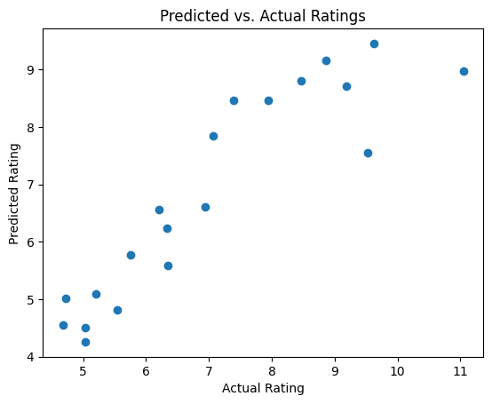
    


```python
import matplotlib.font_manager

print([f.name for f in matplotlib.font_manager.fontManager.ttflist])

```

    ['DejaVu Sans', 'STIXGeneral', 'DejaVu Sans Display', 'STIXSizeOneSym', 'DejaVu Sans', 'DejaVu Serif', 'DejaVu Sans', 'cmr10', 'STIXSizeThreeSym', 'STIXSizeFiveSym', 'STIXGeneral', 'DejaVu Serif', 'cmex10', 'DejaVu Sans Mono', 'DejaVu Serif', 'STIXSizeTwoSym', 'DejaVu Sans Mono', 'DejaVu Serif', 'cmtt10', 'STIXSizeFourSym', 'STIXSizeFourSym', 'DejaVu Sans Mono', 'cmb10', 'STIXSizeTwoSym', 'STIXGeneral', 'STIXSizeThreeSym', 'DejaVu Sans Mono', 'STIXSizeOneSym', 'STIXNonUnicode', 'STIXNonUnicode', 'cmsy10', 'DejaVu Sans', 'STIXNonUnicode', 'cmmi10', 'STIXNonUnicode', 'DejaVu Serif Display', 'cmss10', 'STIXGeneral', 'Calisto MT', 'Kushpoo', 'TAM Auvaiyar', 'Agency FB', 'Franklin Gothic Medium Cond', 'Curlz MT', 'HoloLens MDL2 Assets', 'NelumPC', 'Shanmugapriya', 'Georgia', 'Lucida Fax', 'Eelamlead', 'Freestyle Script', 'K', 'Courier New', 'Priya', 'Segoe MDL2 Assets', 'Lucida Bright', 'Consolas', 'Microsoft Uighur', 'Tw Cen MT', 'Mistral', 'Lucida Handwriting', 'Times New Roman', 'Arial', 'Sirippu', 'Xpatmana', 'Georgia', 'Anuradha-PC', 'Hindolam', 'Damindu*-Tall', 'Boopalam', 'Boopalam', 'TAM Cheran', 'TAM Manohari', 'Pristina', 'RAVI-D', 'Centaur', 'Mathi', 'Century Schoolbook', 'Lucida Bright', 'Viner Hand ITC', 'TAM Auvaiyar', 'Calibri', 'Arial Unicode MS', 'Candara', 'Corbel', 'Ranjani', 'MI_Harsha', 'Impact', 'Sitka Small', 'Gigi', 'Rasigapria', 'Jokerman', 'Nirmala UI', 'Ebrima', 'Boopalam', 'SriLanka', 'Padma', 'SIN Walawe', 'Thissamaharama', 'Thanusha', 'Malgun Gothic', 'Vairamani', 'Saraswathy', 'Calibri', 'Microsoft Tai Le', 'Holidays MT', 'Mi-Aradhana', 'Trebuchet MS', 'Goudy Old Style', 'Segoe UI', 'Lucida Sans', 'Imprint MT Shadow', 'Calibri', 'Book Antiqua', 'Myanmar Text', 'Rockwell Extra Bold', 'Wingdings 3', 'Broadway', 'Sitka Small', 'Kalaham', 'SIN Walawe', 'French Script MT', 'Lucida Fax', 'Lucida Sans', 'Lucida Sans', 'Gill Sans MT Condensed', 'Berlin Sans FB Demi', 'High Tower Text', 'Californian FB', 'RAVI-C', 'Copperplate Gothic Light', 'Mohanam', 'Schneidler Md BT', 'Thisha', 'Monotype Corsiva', 'Franklin Gothic Book', 'Calibri', 'Segoe UI', 'Microsoft PhagsPa', 'Wide Latin', 'Gadugi', 'Eras Medium ITC', 'Bahnschrift', 'Sitka Small', 'RAVI-B', 'Thara', 'Leelawadee UI', 'Rockwell', 'Waartha', 'Bodoni MT', 'Lucida Sans Typewriter', 'Matura MT Script Capitals', 'Cambria', 'Tw Cen MT Condensed', 'High Tower Text', 'Mullai', 'Haettenschweiler', 'Bookshelf Symbol 7', 'Century Gothic', 'Californian FB', 'Thamar', 'Blackadder ITC', 'Phyngern', 'Arial', 'Dubai', 'Bookman Old Style', 'Informal Roman', 'Sports Three MT', 'Lakshman', 'LankapuraSupplement', 'Palatino Linotype', 'Bon Apetit MT', 'Bernard MT Condensed', 'Rockwell Condensed', 'Segoe UI Historic', 'Microsoft PhagsPa', 'Elephant', 'TAM Kambar-ExtraBold', 'LankaTilaka', 'Lucida Calligraphy', 'Geethapria', 'Rasigapriya', 'Sashi', 'Georgia', 'Mongolian Baiti', 'SIN Walawe', 'Microsoft New Tai Lue', 'Papyrus', 'Webdings', 'Franklin Gothic Heavy', 'Yu Gothic', 'Bamini', 'Lankanatha', 'Arial', 'Modern No. 20', 'Baskerville Old Face', 'Corbel', 'Consolas', 'Sholan', 'Castellar', 'Lucida Sans Typewriter', 'Wingdings 2', 'Lucida Sans Typewriter', 'Comic Sans MS', 'Lathangi', 'MMDrawings', 'Bell MT', 'Perpetua Titling MT', 'Aiswaria', 'Divya', 'Lucida Sans Typewriter', 'Goudy Old Style', 'Segoe UI', 'Maiandra GD', 'Ranasuru-PC', 'Segoe UI', 'Sevvanthi', 'Mi_Dasun*_96', 'Chiller', 'Verdana', 'Magneto', 'Courier New', 'Bodoni MT', 'Palatino Linotype', 'Hemawathy', 'Mohanam', 'RAVI-A', 'LaserTrain', 'Bodoni MT', 'Segoe UI', 'Book Antiqua', 'Vladimir Script', 'Thanusha', 'Yu Gothic', 'Perpetua', 'Tahoma', 'Times New Roman', 'Forte', 'Calisto MT', 'Gill Sans Ultra Bold Condensed', 'TAM Kambar', 'TAM Kambar', 'MS Gothic', 'Consolas', 'Tempus Sans ITC', 'Sindhubairavi', 'Cambria', 'Leelawadee', 'Microsoft Sans Serif', 'MS Reference Specialty', 'ShelleyVolante BT', 'Shinthujah', 'Kamaas', 'KELANI', 'RidhmaPlain', 'Sorinaai', 'Segoe Print', 'Tw Cen MT Condensed', 'Goudy Stout', 'Century Schoolbook', 'Mi_Dasuni*_96', 'Mi_Damindu*_96', 'Gill Sans Ultra Bold', 'Comic Sans MS', 'Engravers MT', 'Eras Light ITC', 'Cascadia Code', 'Mi_Dasun*', 'Rasihapriya', 'Untitled', 'Boopalam', 'Calibri', 'Rockwell', 'Old English Text MT', 'MS Outlook', 'ShelleyAllegro BT', 'TAM ThiruValluvar', 'Bell MT', 'Nirmala UI', 'Maniyahram', 'Shinthujah', 'aKandyNewSupplement', 'OCR A Extended', 'Tw Cen MT', 'Brush Script MT', 'Dubai', 'Microsoft YaHei', 'Microsoft Himalaya', 'Sylfaen', 'Yu Gothic', 'Arial', 'Shinthujah', 'Ananthabairavi', 'Showcard Gothic', 'Berlin Sans FB', 'Felix Titling', 'TAM Manohari', 'Calisto MT', 'Edwardian Script ITC', 'Leelawadee', 'Kaanada', 'Jaffna', 'Corbel', 'Javanese Text', 'MS Reference Sans Serif', 'Saraswathy', 'Times New Roman', 'Trebuchet MS', 'Adankappidaari', 'Lankadveepa', 'Adaanaa', 'Berlin Sans FB', 'TAM ThiruValluvar', 'ShelleyAndante BT', 'Kalyani', 'Uthayam', 'Seagull Lt BT', 'Constantia', 'Mi_Dasun*_Hollow_96', 'Copperplate Gothic Bold', 'Rockwell Condensed', 'Colonna MT', 'Harlow Solid Italic', 'Franklin Gothic Demi Cond', 'Cambria', 'Cascadia Mono', 'Palace Script MT', 'Yu Gothic', 'Segoe UI', 'Arial', 'Saraswathy', 'Thanusha', 'Candara', 'TAM Auvaiyar', 'Century Gothic', 'Mi_Harsha*_96', 'Malgun Gothic', 'MMCheckered', 'Perpetua', 'Bradley Hand ITC', 'Thanusha', 'Rage Italic', 'Calisto MT', 'Gill Sans MT', 'Bell MT', 'Arial', 'Microsoft Tai Le', 'Segoe UI Emoji', 'Microsoft New Tai Lue', 'Bodoni MT', 'Singari', 'TAM Cheran', 'Cooper Black', 'Snap ITC', 'Segoe UI', 'Vilakku', 'Microsoft JhengHei', 'Tw Cen MT Condensed Extra Bold', 'Jothy', 'Wingdings', 'Arial Rounded MT Bold', 'Parties MT', 'Lankatilaka Suppliment', 'Lankanatha Suppliment', 'Palatino Linotype', 'RefSpecialty', 'Agency FB', 'Segoe Script', 'Calibri', 'Microsoft JhengHei', 'Eras Bold ITC', 'Parchment', 'Arial', 'LaserTrain', 'Candara', 'Garamond', 'Ravie', 'Courier New', 'Candara', 'Candara', 'Century Gothic', 'Bauhaus 93', 'Leelawadee UI', 'Lucida Bright', 'TAM Cheran', 'Perpetua Titling MT', 'TAM ThiruValluvar', 'Century Gothic', 'Mohanam', 'Comic Sans MS', 'Rockwell', 'Segoe UI', 'Lucida Fax', 'Constantia', 'Thissamaharama Supplement', 'Gill Sans MT', 'Trebuchet MS', 'Franklin Gothic Heavy', 'Preethi', 'Bookman Old Style', 'TAM Kambar', 'Book Antiqua', 'Kampothi', 'Symbol', 'TAM Auvaiyar', 'Malligai', 'Mi_Harsha*_Hollow_96', 'Nallur', 'Bookman Old Style', 'Segoe UI', 'Myanmar Text', 'Directions MT', 'Thisha', 'Lankapura', 'Rathnangi', 'Corbel', 'Century Schoolbook', 'Karaharapriya', 'Constantia', 'Franklin Gothic Medium', 'Bodoni MT', 'Lucida Sans Unicode', 'aSinhalaApple', 'Harrington', 'Corbel', 'Dubai', 'Kristen ITC', 'Signs MT', 'RidhmaBold', 'Segoe UI', 'Malgun Gothic', 'TAM Kamraj', 'BobsExtraPictures', 'Hela', 'Lucida Console', 'Script MT Bold', 'Segoe UI Symbol', 'Matara', 'Arial', 'Lavanya', 'Kandy Supplement', 'Matara Supplement', 'Onyx', 'Vivaldi', 'Seagull Hv BT', 'TAM Cheran', 'Sports Two MT', 'Karmukil', 'Franklin Gothic Demi', 'Gadugi', 'Microsoft YaHei', 'RAVI-E', 'Gabriola', 'Pookkal', 'Keystrokes MT', 'Cambria', 'Eras Demi ITC', 'Senkadagala Supplement', 'Aabohi', 'Kilavi', 'Perpetua', 'Ranjani', 'Constantia', 'Playbill', 'Century', 'Lakshmi', 'Footlight MT Light', 'Microsoft YaHei', 'Pichchaikari', 'Lathangi', 'Tw Cen MT', 'Californian FB', 'Alankaram', 'MingLiU-ExtB', 'NilanthiLT-PC', 'Mahanuwara', 'Segoe Script', 'Consolas', 'Anuradhapura Supplement', 'Bodoni MT', 'LankadveepaSupplement', 'Thisha', 'Tahoma', 'RENUKA  ', 'Microsoft Uighur', 'Candara', 'Georgia', 'Rahasiam', 'Stencil', 'Garamond', 'seran', 'Niagara Solid', 'Poor Richard', 'Mahanuwara Supplement', 'Kandy', 'aKandyNew', 'Kamaas', 'Bodoni MT', 'Gill Sans MT', 'Gangha', 'MV Boli', 'Singaram', 'Verdana', 'CHAMARA', 'Ebrima', 'Gill Sans MT Ext Condensed Bold', 'Ram', 'Microsoft JhengHei', 'Palatino Linotype', 'Trebuchet MS', 'Nagananthini', 'Tw Cen MT', 'Pandian', 'Segoe Print', 'Perpetua', 'Gloucester MT Extra Condensed', 'TAM ThiruValluvar', 'Bodoni MT', 'Sandaya', 'Kalaivani', 'Mi-Pathum', 'Lucida Bright', 'Goudy Old Style', 'MT Extra', 'Anuradhapura', 'SimSun-ExtB', 'Saraswathy', 'Courier New', 'Algerian', 'Ranaviru- PC', 'TAM Kambar', 'Britannic Bold', 'Dubai', 'Microsoft Yi Baiti', 'Juice ITC', 'Bodoni MT', 'Ink Free', 'Segoe UI', 'Segoe UI', 'TAM Kambar-ExtraBold', 'Nirmala UI', 'Garamond', 'Bodoni MT', 'Elephant', 'Lucida Sans', 'Kunstler Script', 'Senkadagala', 'Franklin Gothic Book', 'SIN Walawe', 'Century Schoolbook', 'Corbel', 'Comic Sans MS', 'Bookman Old Style', 'MataraApple1', 'Arial', 'Verdana', 'Leelawadee UI', 'Sitka Small', 'Niagara Engraved', 'Franklin Gothic Demi', 'TAM Kamraj', 'Franklin Gothic Medium', 'Sngarabaranam', 'Bodoni MT', 'SimSun', 'Rockwell', 'Gill Sans MT', 'Times New Roman', 'Verdana', 'Book Antiqua', 'Lucida Fax']
    


```python
import numpy as np
import pandas as pd
from sklearn.model_selection import train_test_split
from sklearn.ensemble import RandomForestClassifier
from sklearn.metrics import accuracy_score

```


```python
features = df[['User_Contributions', 'Rating']]

```


```python
target = df['Helpful_Votes']

```


```python
print("Features:")
print(features.head())

print("\nTarget:")
print(target.head())

```

    Features:
       User_Contributions  Rating
    0                   8       5
    1                   4       4
    2                  13       5
    3                   4       5
    4                  14       5
    
    Target:
    0    1
    1    0
    2    0
    3    0
    4    0
    Name: Helpful_Votes, dtype: int64
    


```python
unique_values = df['Helpful_Votes'].unique()

```


```python
print("Unique Values of 'Helpful_Votes':")
print(unique_values)

```

    Unique Values of 'Helpful_Votes':
    [  1   0   4   9   8   3   2   6   7  12  13  48  10   5  17  71  14  62
      53  22  16  11 233  90 166  19  82  93 180  21  18  63  40  34  15 182]
    


```python
# Check the columns in the DataFrame
print(df_encoded.columns)

# Select relevant features
features = df_encoded[['Location', 'Travel_Date', 'Rating', 'Helpful_Votes']]

# Remove unnecessary columns
# Ensure 'Text' is present in the columns before attempting to drop it
if 'Text' in features.columns:
    features = features.drop(['Text'], axis=1)
else:
    print("'Text' column not found in features.")

# Continue with the rest of your code...


```

    Index(['Location', 'Location_Type', 'User_ID', 'User_Contributions',
           'Travel_Date', 'Published_Date', 'Rating', 'Helpful_Votes', 'Title',
           'Text',
           ...
           'User_Locale_ru_RU', 'User_Locale_sk', 'User_Locale_sk_SK',
           'User_Locale_sr', 'User_Locale_sv', 'User_Locale_sv_SE',
           'User_Locale_tr', 'User_Locale_tr_TR', 'User_Locale_vi',
           'User_Locale_zh_TW'],
          dtype='object', length=3546)
    'Text' column not found in features.
    


```python
# Check the column names in the DataFrame
print(df_encoded.columns)

# Assuming 'Number_of_Tourists' might have a different name or doesn't exist
# Adjust the column name accordingly based on your dataset
# For example, if the column represents the number of tourists, find the corresponding column name
# Then use it to define your target variable
target_column_name = 'Number_of_Tourists'

# Check if the target column exists in the DataFrame
if target_column_name in df_encoded.columns:
    target = df_encoded[target_column_name]
else:
    print(f"'{target_column_name}' column not found in the DataFrame. Please verify the column name.")

# Continue with the rest of your code...

```

    Index(['Location', 'Location_Type', 'User_ID', 'User_Contributions',
           'Travel_Date', 'Published_Date', 'Rating', 'Helpful_Votes', 'Title',
           'Text',
           ...
           'User_Locale_ru_RU', 'User_Locale_sk', 'User_Locale_sk_SK',
           'User_Locale_sr', 'User_Locale_sv', 'User_Locale_sv_SE',
           'User_Locale_tr', 'User_Locale_tr_TR', 'User_Locale_vi',
           'User_Locale_zh_TW'],
          dtype='object', length=3546)
    'Number_of_Tourists' column not found in the DataFrame. Please verify the column name.
    


```python
from sklearn.model_selection import train_test_split

# Split the dataset
X_train, X_test, y_train, y_test = train_test_split(features, target, test_size=0.2, random_state=42)

```


```python
print(df.columns)

```

    Index(['Location_Name', 'Located_City', 'Location', 'Location_Type', 'User_ID',
           'User_Location', 'User_Locale', 'User_Contributions', 'Travel_Date',
           'Published_Date', 'Rating', 'Helpful_Votes', 'Title', 'Text', 'Year'],
          dtype='object')
    


```python
import pickle

with open('model_pickle','wb') as f:
    pickle.dump(model,f)
```


```python
import pickle

with open('model_pickle', 'rb') as file:
    loaded_model = pickle.load(file)

```


```python
for column in X.columns:
    print(column)
```

    User_Contributions
    Helpful_Votes
    


```python

```
